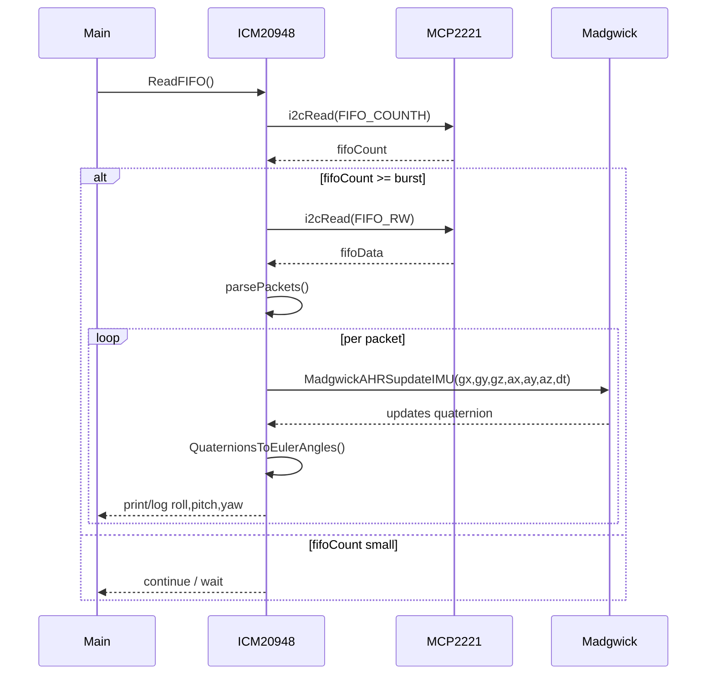

## IMU_project — Short Technical Documentation

This document summarizes how the current IMU project works, highlights the main function call stacks and shows flow diagrams for initialization and the runtime FIFO processing loop.

### Files of interest
- `main.cpp` — program entry, initializes the MCP2221 USB/I2C bridge, constructs the ICM20948 IMU instance, runs initialization, FIFO config and the main read loop.
- `MCP/mcp2221.h` & `MCP/mcp2221.cpp` — wrapper class `MCP2221` around the MCP2221 device DLL. Provides thread-safe access to the device via an internal `std::mutex` and exposes methods like `open()`, `close()`, `i2cWrite()`, `i2cRead()` and helpers.
- `ICM/icm20948.h` & `ICM/icm20948.cpp` — driver for the ICM-20948 IMU. Implements initialization, sensor configuration, FIFO configuration and the FIFO read/parse logic. Uses the `MCP2221` instance for all I2C/USB operations.
- `sensorfusion/Madgwick.h` & `sensorfusion/Madgwick.cpp` — Madgwick AHRS implementation. Exposes `MadgwickAHRSupdateIMU()` and `QuaternionsToEulerAngles()` used to compute orientation.
- `include/threadsafe_queue.h` — utility templated thread-safe queue (mutex + condition variable). Useful for producer/consumer designs.
- `include/sample.h` — `ImuSample` struct describing per-sample data layout.

---

## High-level behavior

1. Program start (`main.cpp`):
   - Construct `MCP2221` and call `mcp2221.open()` to open the USB/I2C bridge.
   - Construct `ICM20948 IMU1(mcp2221, address)`.
   - Call `IMU1.Initialize()` -> config and sensor enable.
   - Call `IMU1.FIFOConfig()` and then `IMU1.CalibrateAccelGyro(...)` (optional calibration).
   - Call `IMU1.ReadFIFO()` — enters a loop that reads FIFO bursts, parses packets, runs the Madgwick filter and prints/logs orientation.
   - On exit, call `mcp2221.close()`.

2. Device access and synchronization:
   - All direct hardware communications go through `MCP2221` methods.
   - `MCP2221` contains `mutable std::mutex mtx;` and uses `std::lock_guard<std::mutex>` in public methods to serialize concurrent access.
   - `threadsafe_queue.h` is provided for safe multi-threaded producer/consumer queues, although the current main loop is single-threaded.

---

## Main call stack (initialization)

- main()
  - MCP2221::open()
    - (calls into external DLL: Mcp2221_GetConnectedDevices, Mcp2221_OpenByIndex, etc.)
  - ICM20948::ICM20948(mcpRef, addr) [constructor]
  - ICM20948::Initialize()
    - ICM20948::SelectBank(0)
      - MCP2221::i2cWrite(address, bankBuffer)
    - MCP2221::i2cReadSingle(address, WHOAMI)
    - MCP2221::i2cWrite(address, reset)
    - ICM20948::EnableSensors(...)
      - MCP2221::i2cReadSingle(...)
      - MCP2221::i2cWrite(...)
    - ICM20948::SensorConfig()
      - ICM20948::SelectBank(2)
      - ICM20948::GyroConfig() -> MCP2221::i2cWrite()
      - ICM20948::AccelConfig() -> MCP2221::i2cWrite()

Notes: each `MCP2221` call uses an internal mutex so concurrent calls are serialized.

---

## Main call stack (runtime FIFO read & processing)

- main() -> ICM20948::ReadFIFO()
  - loop:
    - MCP2221::i2cRead(address, FIFO_COUNTH, data)  // get FIFO count
    - if FIFO sufficiently large:
      - MCP2221::i2cRead(address, FIFO_RW, fifoData) // read burst
      - parse packets -> for each packet:
        - convert bytes to accel/gyro floats
        - call MadgwickAHRSupdateIMU(gx, gy, gz, ax, ay, az, dt)
          - updates quaternion globals (q0..q3)
        - call QuaternionsToEulerAngles(euler)
          - computes roll,pitch,yaw from quaternion
        - log/print values

This loop continues until user input (press 'C') or error.

---

## Thread-safety locations

- `MCP/mcp2221.h` / `MCP/mcp2221.cpp` — protects the `handler` and all device operations with `mutable std::mutex mtx` and `std::lock_guard<std::mutex>`.
- `include/threadsafe_queue.h` — generic `TSQueue<T>` implemented with `std::mutex`, `std::condition_variable` and `std::deque<T>`.

If you plan to move FIFO reads into a background thread and push per-sample data to a consumer, use `TSQueue<ImuSample>`.

---

## Flow diagrams

### Initialization flow (mermaid flowchart)

```mermaid
flowchart TD
    A[Start: main()] --> B[MCP2221::open()]
    B --> C[Construct ICM20948(mcp,address)]
    C --> D[ICM20948::Initialize()]
    D --> E[SelectBank(0)]
    E --> F[MCP:i2cReadSingle(WHOAMI)]
    F --> G[MCP:i2cWrite(reset)]
    G --> H[EnableSensors()]
    H --> I[SensorConfig() -> GyroConfig(), AccelConfig()]
    I --> J[FIFOConfig()]
    J --> K[CalibrateAccelGyro()] 
    K --> L[Proceed to ReadFIFO()]
```

### Runtime FIFO processing (mermaid sequence)



Notes: `MCP` calls use internal mutex so the `i2cRead`/`i2cWrite` operations are thread-safe if called concurrently.

---

## How to add a producer/consumer threading model (suggestion)

1. Create a background thread that runs `ICM20948::ReadFIFO()` or a variant that reads bursts and pushes parsed `ImuSample` objects onto `TSQueue<ImuSample>`.
2. Create one or more consumer threads that pop `ImuSample` from the `TSQueue` and call `MadgwickAHRSupdateIMU()` + `QuaternionsToEulerAngles()` or other processing.
3. Because `MCP2221` already serializes access with a mutex, hardware access is safe; `TSQueue` ensures safe inter-thread communication.

Example sketch (pseudo):

```cpp
TSQueue<ImuSample> q;
std::thread reader([&]{
    while(running) {
        auto batch = IMU.readBurst(); // new non-blocking method
        for(sample: batch) q.enqueue(sample);
    }
});

std::thread consumer([&]{
    ImuSample s;
    while(running) {
        s = q.wait_dequeue();
        MadgwickAHRSupdateIMU(...);
    }
});
```

---

## Build & run

- This project uses CMake. From the repository root you can build with your preferred generator (Visual Studio or MSVC). Typical sequence in PowerShell:

```powershell
# from project root
mkdir build; cd build
cmake ..
cmake --build . --config Release
```

Run the produced executable (the project currently targets Windows and uses `GetAsyncKeyState` and Win32 headers).

---

## Closing notes

- I inspected the repository files to extract the call stacks and flows. The new `DOCUMENTATION.md` lives at the project root and is intended as a compact starting point.
- If you want, I can:
  - Expand the diagrams (generate PNG/SVG) or place ASCII art suitable for non-mermaid viewers.
  - Add an example threaded refactor that uses `TSQueue<ImuSample>` and update `CMakeLists.txt` if additional source files are added.

---

End of document.
